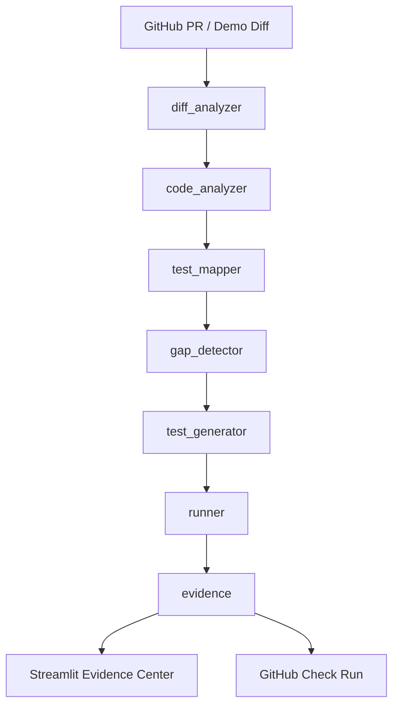

# ProofChange

**AI Change Verification for Software Teams**

> Every code change needs evidence.

ProofChange is an AI-powered verification layer for software
development. It analyzes a code change, identifies affected functions
and execution paths, maps existing tests, detects missing scenarios,
assists with test generation, executes tests, and produces a
**Change Evidence Package**.

**This is not just test generation. This is change verification.**

---

## 1. Problem

CI answers: *"Did the configured tests pass?"*

It does not answer: *"Is the newly changed behavior adequately
verified?"*

A PR can add a new branch, a new edge case, or a new execution path
while CI stays green — because the existing tests never touched the
new code.

## 2. Solution

ProofChange closes that gap. For every change it:

1. Parses the diff.
2. Analyzes the changed code with Python AST.
3. Maps existing tests to affected functions.
4. Detects missing scenarios (test gaps).
5. Assists with test generation (Bob-assisted workflow).
6. Executes the generated tests with real pytest.
7. Produces a Change Evidence Package with an evidence level.

## 3. Why ProofChange

- **Change-centric.** Built around a specific change, not the whole repo.
- **Evidence-first.** The core artifact is a Change Evidence Package,
  not a chat response.
- **Honest.** Uses *analyzed paths*, *inferred scenarios*, and
  *verification evidence* — never formal proof claims.
- **Pluggable AI.** Bob-compatible adapter; no undocumented API assumptions.

## 4. Architecture

---

## 5. IBM Bob 2.0 Usage

### Bob IDE tasks during development

IBM Bob IDE was used throughout development for the following tasks:

| Task | Activity |
|---|---|
| Repository understanding | Architecture walkthrough of all pipeline modules |
| Gap detector deep dive | Execution trace through `gap_detector` logic |
| `ai_assisted_steps` field | Added to `EvidencePackage` with Bob guidance |
| Edge-case pytest tests | Wrote `test_zero_price` and `test_vip_beats_premium` |
| This README section | Generated and refined with Bob |

### AI modes (`ai/bob_adapter.py`)

ProofChange supports two modes, set via the `AI_MODE` environment variable:

- **`documented_bob_workflow`** *(default)* — the automated engine runs the
  pipeline; Bob task prompts in [`ai/prompts.py`](ai/prompts.py) are the
  documented interface and are used with IBM Bob IDE.
- **`runtime_llm`** *(opt-in)* — ProofChange calls a Bob-compatible OpenAI-
  shaped endpoint (`BOB_API_URL` + `BOB_API_KEY`). Falls back gracefully if
  the endpoint is unavailable.

### Reusable Bob task prompts (`ai/prompts.py`)

Five prompts are defined in `ai/prompts.py` and map 1-to-1 to adapter methods:

1. **Repository Understanding** — `analyze_change()`
2. **Test Gap Analysis** — `detect_gaps()`
3. **Test Generation** — `generate_tests()`
4. **Failure Analysis** — `analyze_failure()`
5. **Verification Summary** — `create_summary()`

### Artifact labeling

Every pipeline artifact records its source (`"bob-assisted"` vs
`"runtime_llm"`) so the origin of every decision is always traceable.

### Bob IDE session evidence

Bob IDE task session screenshots are stored in `bob_sessions/` as
evidence of Bob usage during development.