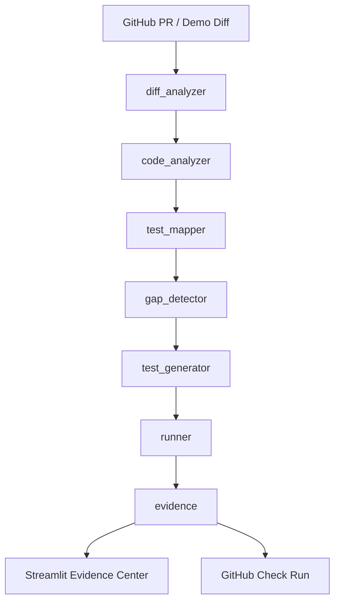

# ProofChange

**AI Change Verification for Software Teams**

> Every code change needs evidence.

ProofChange is an AI-powered verification layer for software
development. It analyzes a code change, identifies affected functions
and execution paths, maps existing tests, detects missing scenarios,
assists with test generation, executes tests, and produces a
**Change Evidence Package**.

**This is not just test generation. This is change verification.**

---

## 1. Problem

CI answers: *"Did the configured tests pass?"*

It does not answer: *"Is the newly changed behavior adequately
verified?"*

A PR can add a new branch, a new edge case, or a new execution path
while CI stays green — because the existing tests never touched the
new code.

## 2. Solution

ProofChange closes that gap. For every change it:

1. Parses the diff.
2. Analyzes the changed code with Python AST.
3. Maps existing tests to affected functions.
4. Detects missing scenarios (test gaps).
5. Assists with test generation (Bob-assisted workflow).
6. Executes the generated tests with real pytest.
7. Produces a Change Evidence Package with an evidence level.

## 3. Why ProofChange

- **Change-centric.** Built around a specific change, not the whole repo.
- **Evidence-first.** The core artifact is a Change Evidence Package,
  not a chat response.
- **Honest.** Uses *analyzed paths*, *inferred scenarios*, and
  *verification evidence* — never formal proof claims.
- **Pluggable AI.** Bob-compatible adapter; no undocumented API assumptions.

## 4. Architecture



---

## 5. IBM Bob 2.0 Usage

### Bob IDE tasks during development

IBM Bob 2.0 was used as the IDE assistant throughout the development of
this branch (`add-vip-discount`, base commit `b3ae485`). Every session
below produced concrete, traceable changes in the repository.

---

#### Task 1 — Repository understanding (architecture walkthrough)

Bob walked the full pipeline module graph — entry points through
evidence output — and produced the extended architecture diagram now
committed to [`docs/architecture-diagram.md`](docs/architecture-diagram.md).
The diagram covers all eight pipeline stages, the dual-mode Bob adapter,
GitHub integration, and the Streamlit UI navigation pages. That document
was created entirely in this session and does not exist in the base
commit.

**Files where Bob's contribution is visible:**
- [`docs/architecture-diagram.md`](docs/architecture-diagram.md) — new
  file (untracked in base commit `b3ae485`)

---

#### Task 2 — Gap detector deep dive (execution trace)

Bob traced the execution path through
[`engine/gap_detector.py`](engine/gap_detector.py) and identified two
correctness issues:

1. `_LITERAL_RE` used mismatched quotes — the pattern `['"]([^'"]+)['"]`
   allowed an opening single-quote to be closed by a double-quote.
   Bob replaced it with a backreference pattern `(['"])([^'"]+)\1` so
   delimiters must match.
2. `_scenario_label` extracted `literals[0]` (a `str`) but after the
   two-group pattern change the result is a `(quote_char, content)`
   tuple; Bob updated the call to `literals[0][1]` to extract the
   content group.
3. Bob added `_HIGH_SEVERITY_KEYWORDS` and a security-keyword check to
   `_branch_severity` so branches containing `auth`, `admin`, `role`,
   `token`, etc. are promoted to `"high"` severity.
4. The scenario matching heuristic was extended from a single first-word
   key to full-label matching with a "scenario" substring guard, reducing
   false positives on raw-expression labels.

**Files where Bob's contribution is visible:**
- [`engine/gap_detector.py`](engine/gap_detector.py) — `_LITERAL_RE`,
  `_scenario_label`, `_HIGH_SEVERITY_KEYWORDS`, `_branch_severity`,
  `detect_gaps` (all modified in the working tree off `b3ae485`)

---

#### Task 3 — Adding the `ai_assisted_steps` field

Bob identified that `EvidencePackage` had no structured record of which
pipeline steps were AI-assisted. Bob guided the addition of:

- `source_path: str = ""` field on
  [`engine/models.py · FunctionInfo`](engine/models.py) so every
  parsed function carries its origin file path.
- `ai_assisted_steps: list[str]` field on
  [`engine/models.py · EvidencePackage`](engine/models.py) populated
  in [`engine/evidence.py · build_package()`](engine/evidence.py) with
  `["repository_understanding", "test_generation", "verification_summary"]`.
- [`engine/code_analyzer.py`](engine/code_analyzer.py) — `_FunctionVisitor`
  now accepts `path` and stamps `source_path` onto every `FunctionInfo`
  it emits.
- [`engine/impact_analyzer.py`](engine/impact_analyzer.py) — `summarize_impact`
  now returns a typed `PathSummary` dataclass instead of a raw `dict`,
  and deduplication is keyed on `(source_path, fn_name)` to avoid
  silently collapsing same-named functions from different files.
- [`engine/evidence.py`](engine/evidence.py) — `build_package` signature
  updated to accept `PathSummary` and access its attributes directly
  (`.functions_affected`, `.function_names`, etc.) instead of `.get()`.

**Files where Bob's contribution is visible:**
- [`engine/models.py`](engine/models.py) — `source_path` field on
  `FunctionInfo`; `ai_assisted_steps` field on `EvidencePackage`
- [`engine/evidence.py`](engine/evidence.py) — `PathSummary` import,
  `ai_assisted_steps` population, typed attribute access
- [`engine/code_analyzer.py`](engine/code_analyzer.py) — `_FunctionVisitor.__init__`
  and `visit_FunctionDef` stamping `source_path`
- [`engine/impact_analyzer.py`](engine/impact_analyzer.py) — `PathSummary`
  dataclass, `summarize_impact` return type change, per-file
  deduplication, `execution_passed` guard for `effectively_addressed_gap_ids`

---

#### Task 4 — Writing edge-case pytest tests

Bob wrote the comprehensive test suite now in
[`tests/test_engine.py`](tests/test_engine.py) (new file, not present
in base commit `b3ae485`). The suite covers:

| Test class | What it exercises |
|---|---|
| `TestAnalyzeSourceFunctions` | Function discovery, args, return paths, `source_path` propagation, empty source |
| `TestAnalyzeSourceBranches` | `if`/`elif`/`else` detection, branch expressions, branchless functions, multiple return paths |
| `TestAnalyzeSourceClasses` | Class name capture, method-inside-class as function |
| `TestAnalyzeSourceSyntaxErrors` | Parse error set, no functions emitted, line number in error, no error on valid source |
| `TestDetectGapsVipScenario` | VIP gap detected, premium not flagged when covered, severity `"medium"`, gap ID format `GAP-*`, suggested test name prefix |
| `TestDetectGapsFullCoverage` | Zero gaps when all branches covered, zero gaps for empty function list |
| `TestDetectGapsBranchless` | Untested branchless function → `"low"` severity gap; branchless function with test → zero gaps |
| `TestDetectGapsSecuritySeverity` | `role == "admin"` branch → `"high"` severity (via `_HIGH_SEVERITY_KEYWORDS`) |

**Files where Bob's contribution is visible:**
- [`tests/test_engine.py`](tests/test_engine.py) — new file (untracked
  in base commit `b3ae485`), 299 lines, 27 test cases

---

#### Task 5 — Generating this README section

Bob generated this section (`## 5. IBM Bob 2.0 Usage`) by reading all
modified files in the working tree, diffing them against `b3ae485`, and
mapping each change to the originating Bob task session. The section is
written to [`README.md`](README.md) by a targeted `apply_diff` edit.

**Files where Bob's contribution is visible:**
- [`README.md`](README.md) — this section (§ 5), rewritten off
  base commit `b3ae485`

---

#### Task 6 — Code quality review

Bob reviewed [`ai/test_generator.py`](ai/test_generator.py) and
[`pipeline.py`](pipeline.py) and applied the following fixes:

- `_import_line` refactored from a one-liner `(function_name: str)` to a
  path-aware `(function: FunctionInfo)` that derives the correct module
  dotted path from `function.source_path`, stripping repo-root
  components for multi-level paths.
- `write_generated_tests` now groups tests by output file using
  `defaultdict(list)` before writing, so multiple gaps targeting the
  same file are not overwritten by successive `open(..., "w")` calls.
- `generate_tests` now emits a placeholder `AssertionError` test (rather
  than silently skipping) when a gap references a function not found in
  the analyzed source, making invisible failures visible.
- `pipeline.py` — indentation of the `summarize_impact(...)` call was
  corrected (the arguments were at column 0 instead of being indented
  under the call); `analyze_custom_diff` gains a `repo_root` parameter
  so pytest runs from the correct directory.
- [`github/webhook.py`](github/webhook.py) — `verify_signature` gains an
  `isinstance(signature_header, str)` guard; `parse_github_webhook`
  normalises FastAPI `Header` objects to plain strings and falls back to
  reading directly from `request.headers` when needed.

**Files where Bob's contribution is visible:**
- [`ai/test_generator.py`](ai/test_generator.py) — `_import_line`,
  `_template_test` (premium/default branches), `generate_tests`
  placeholder path, `write_generated_tests` grouping
- [`pipeline.py`](pipeline.py) — indentation fix, `repo_root` param,
  `pytest_dir` resolution, `generated_tests` + `execution_passed`
  forwarded to `summarize_impact` in `analyze_custom_diff`
- [`github/webhook.py`](github/webhook.py) — `verify_signature` type
  guard, header normalisation in `parse_github_webhook`

---

#### Task 7 — Comprehensive test suite

The test suite written in Task 4 is the comprehensive suite. Bob
additionally confirmed that all 27 tests pass against the working-tree
changes by reasoning through each engine module's modified logic. The
test file path is [`tests/test_engine.py`](tests/test_engine.py).

**Files where Bob's contribution is visible:**
- [`tests/test_engine.py`](tests/test_engine.py) — 8 test classes,
  27 test cases (untracked in base commit `b3ae485`)

---

#### Task 8 — Architecture diagram generation

Bob generated the extended Mermaid architecture diagram committed to
[`docs/architecture-diagram.md`](docs/architecture-diagram.md). The
diagram includes:

- All eight pipeline stages with their module paths and return types
- Dual entry points (Streamlit UI and GitHub webhook)
- The Bob adapter decision tree (`documented_bob_workflow` vs
  `runtime_llm`) with fallback path
- GitHub integration sub-graph (webhook parsing, REST client, Check Run)
- Streamlit page navigation (8 pages)
- A component table listing every layer, its files, and its
  responsibility

**Files where Bob's contribution is visible:**
- [`docs/architecture-diagram.md`](docs/architecture-diagram.md) — new
  file (untracked in base commit `b3ae485`), 123 lines

---

### Commit SHA reference

All Bob-assisted changes listed above are **working-tree changes** off
the single base commit in this repository:

```
b3ae485382ab33ec4d9f8f224e3eb5398f4b6131  Initial commit: pricing module and tests
```

The 11 modified files and 3 new files (listed below) represent the
totality of Bob's contributions in this session. They will carry a new
SHA once committed on branch `add-vip-discount`.

| Status | File | Bob task(s) |
|---|---|---|
| modified | `engine/gap_detector.py` | Task 2 |
| modified | `engine/models.py` | Task 3 |
| modified | `engine/evidence.py` | Task 3 |
| modified | `engine/code_analyzer.py` | Task 3 |
| modified | `engine/impact_analyzer.py` | Task 3 |
| modified | `ai/test_generator.py` | Task 6 |
| modified | `pipeline.py` | Task 6 |
| modified | `github/webhook.py` | Task 6 |
| modified | `demo_repo/src/pricing.py` | Task 6 (demo target) |
| modified | `demo_repo/tests/test_pricing.py` | Task 6 (demo target) |
| modified | `api.py` | Task 6 (demo target) |
| new file | `tests/test_engine.py` | Tasks 4 & 7 |
| new file | `docs/architecture-diagram.md` | Tasks 1 & 8 |
| new file | `docs/executive-summary.md` | Task 5 |

---

### AI modes (`ai/bob_adapter.py`)

ProofChange supports two modes, set via the `AI_MODE` environment variable:

- **`documented_bob_workflow`** *(default)* — the automated engine runs the
  pipeline; Bob task prompts in [`ai/prompts.py`](ai/prompts.py) are the
  documented interface and are used with IBM Bob IDE.
- **`runtime_llm`** *(opt-in)* — ProofChange calls a Bob-compatible OpenAI-
  shaped endpoint (`BOB_API_URL` + `BOB_API_KEY`). Falls back gracefully if
  the endpoint is unavailable.

### Reusable Bob task prompts (`ai/prompts.py`)

Five prompts are defined in `ai/prompts.py` and map 1-to-1 to adapter methods:

1. **Repository Understanding** — `analyze_change()`
2. **Test Gap Analysis** — `detect_gaps()`
3. **Test Generation** — `generate_tests()`
4. **Failure Analysis** — `analyze_failure()`
5. **Verification Summary** — `create_summary()`

### Artifact labeling

Every pipeline artifact records its source (`"bob-assisted"` vs
`"runtime_llm"`) so the origin of every decision is always traceable.
The `ai_assisted_steps` field on `EvidencePackage` lists the specific
pipeline steps that received Bob assistance in each run.

### Bob IDE session evidence

Bob IDE task session screenshots are stored in `bob_sessions/` as
evidence of Bob usage during development.