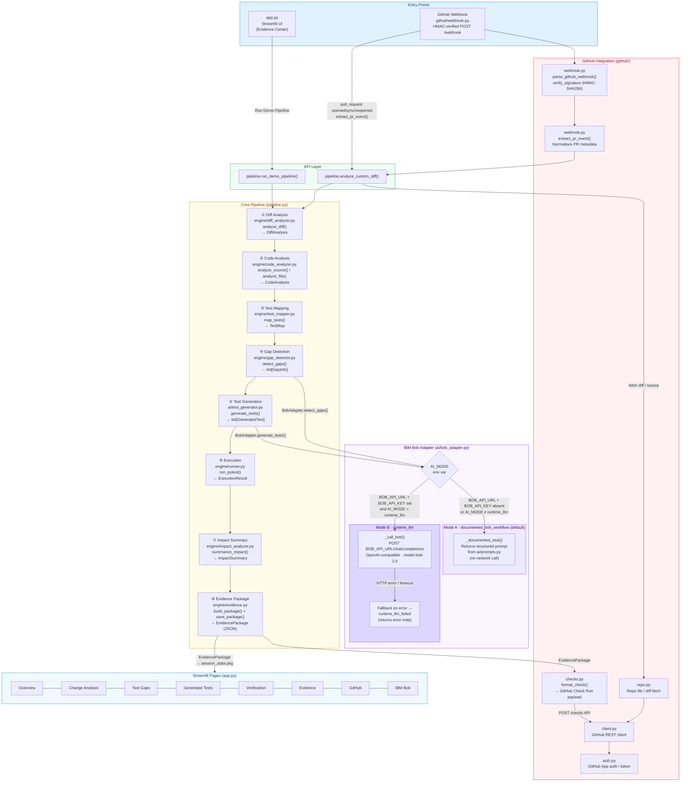

# ProofChange — Architecture Diagram

## Key Components

| Layer | Files | Responsibility |
|---|---|---|
| **Entry — UI** | `app.py` | Streamlit dashboard; 8 navigation pages; triggers `run_demo_pipeline()` |
| **Entry — GitHub** | `github/webhook.py` | HMAC-SHA256-verified webhook; normalises PR events |
| **Pipeline** | `pipeline.py` | Orchestrates all 8 stages; shared by UI and webhook paths |
| **Diff Analysis** | `engine/diff_analyzer.py` | Parses unified diffs → `DiffAnalysis` |
| **Code Analysis** | `engine/code_analyzer.py` | AST-based function/branch extraction → `CodeAnalysis` |
| **Test Mapping** | `engine/test_mapper.py` | Maps source functions to existing test files → `TestMap` |
| **Gap Detection** | `engine/gap_detector.py` | Identifies untested branches → `list[GapInfo]` |
| **Test Generation** | `ai/test_generator.py` | Produces `GeneratedTest` objects via Bob adapter |
| **Execution** | `engine/runner.py` | Runs pytest; captures pass/fail → `ExecutionResult` |
| **Impact Analysis** | `engine/impact_analyzer.py` | Summarises change risk → `ImpactSummary` |
| **Evidence** | `engine/evidence.py` | Builds + persists `EvidencePackage` (JSON + Markdown) |
| **Bob Adapter** | `ai/bob_adapter.py` | **Mode A** `documented_bob_workflow`: returns prompt stubs (no API call). **Mode B** `runtime_llm`: calls `BOB_API_URL/chat/completions` with fallback |
| **GitHub Checks** | `github/checks.py` | Converts `EvidencePackage` → GitHub Check Run payload |
| **GitHub Client** | `github/client.py` + `auth.py` | REST calls + App token auth |
